## U.A High-School :

TryHackMe Easy

Énoncé : 
>Rejoignez-nous dans la mission de protection du monde numérique des super-héros ! UA, la plus célèbre des académies de super-héros, recherche un super-héros pour tester la sécurité de son nouveau site.
>Notre site est le reflet des valeurs de notre école, conçu par nos ingénieurs avec des bizarreries incroyables. Nous avons fait de gros efforts pour créer une plateforme sécurisée qui reflète l'éducation exceptionnelle de l'UA.

Tout d’abord, j’ai commencé par un scan réseau avec nmap à l’aide de la commande :
`nmap -sV -sC 10.10.113.86`
J’ai trouvé les ports 80 (http) et 22 (ssh) d’ouverts
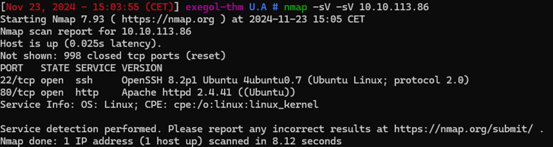

J’ai donc poursuivi l’énumération avec la commande suivante de gobuster :
`gobuster dir -u 10.10.113.86 -w /opt/seclists/Discovery/Web-Content/common.txt`
Ce qui m’a permis de trouver la page :
`http://10.10.113.86/assets`
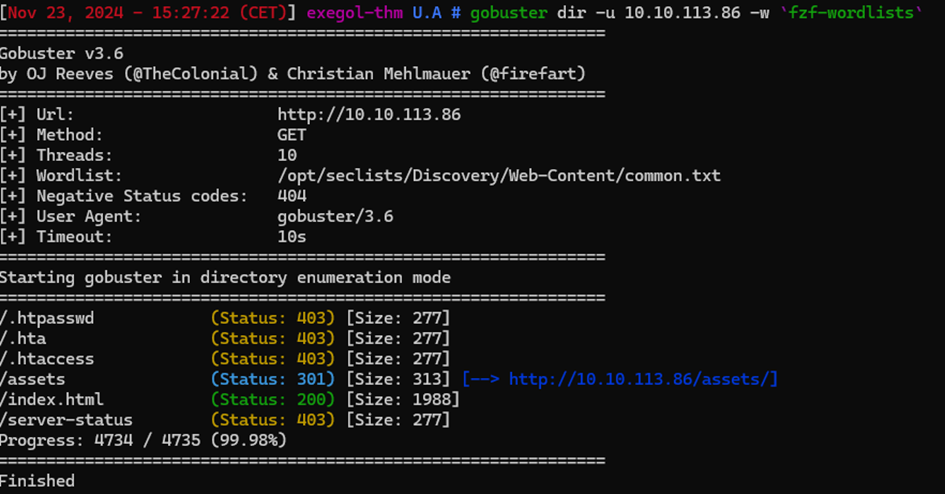

La page étant vierge, j’ai continué l’énumération de puis l’URL toujours avec la même commande : `gobuster dir -u 10.10.113.86/assets/ -w /opt/seclists/Discovery/Web-Content/common.txt` :
`http://10.10.113.86/assets`
Ce qui m’a permis de trouver :
• `http://10.10.113.86/assets/images`
• `http://10.10.113.86/assets/index.php`
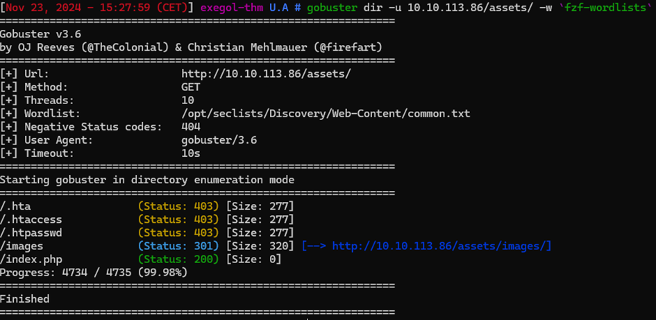

N’ayant pas les droits d’accès à http://10.10.113.86/assets/images
Je suis aller sur http://10.10.113.86/assets/index.php
La page étant aussi vierge j’ai tenté à l’aide de burpsuite de

- Injection xss
- SQLi
  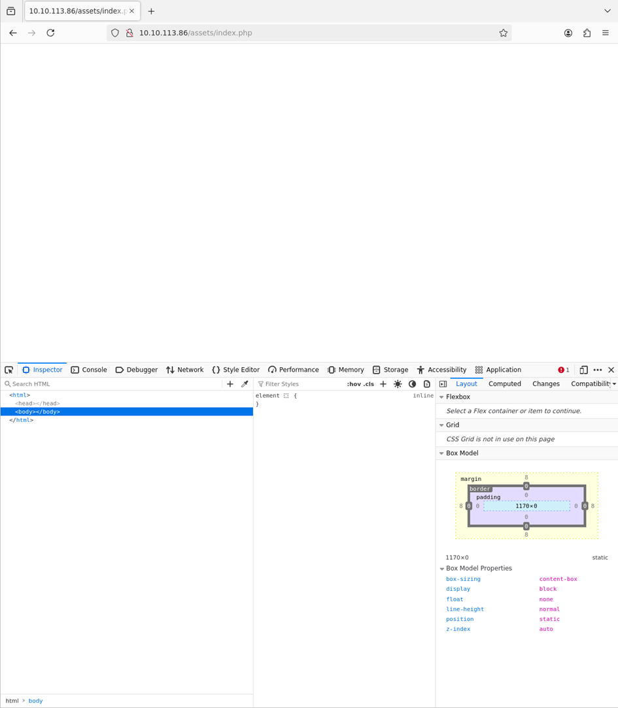

Le site n’étant pas vulnérables aux injection xss et sql, j’ai donc tenté une injection de commande dans l’url : `http://10.10.113.86/assets/index.php ?cmd=ls`.
L’injection de commande ayant fonctionné, j’ai immédiatement tenté le reverse shell.
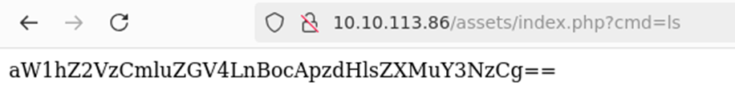
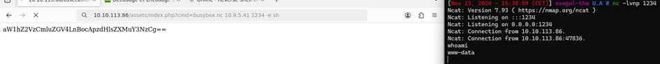

J’ai pu trouver l’utilisateur : deku et un mot de passe encoder en base64 dans le fichier `passphrase.txt` en le décodant j’ai obtenu le passwd : ` AllmightForEver!!!`
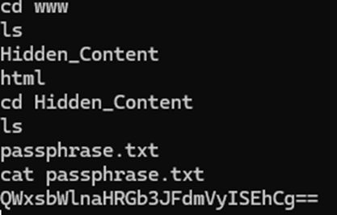

Le port ssh etant ouvert, j’ai dessuite tenter de me connecte avec l’utilisateur : deku et le passwd : AllmightForEver!!!
Le mot de passe n’étant pas celui de l’utilisateur deku pour la connexion ssh, j’ai continué mes recherches en allant explorer le dossier images énumérer par gobuster
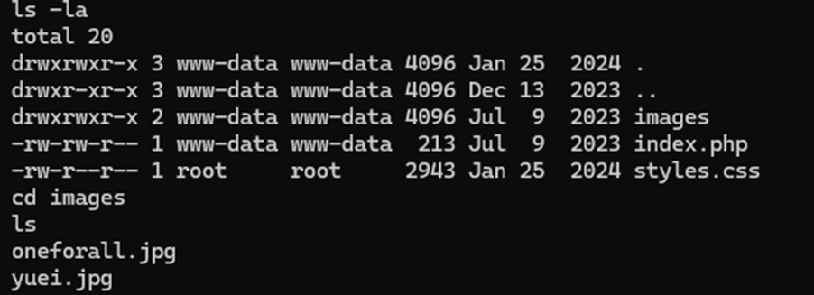

Aider par chatgpt, j’ai dû changer la signature de l’image avec : `hexedit oneforall.jpg`
Ce qui ma créer un fichier « creds.txt » avec les donnees caches recuperer dans l’image qui comportait un autre mot de passe et cette fois-ci celui du l’utilisateur deku, j’ai donc pu faire une connexion ssh et recuperer le premier flag.
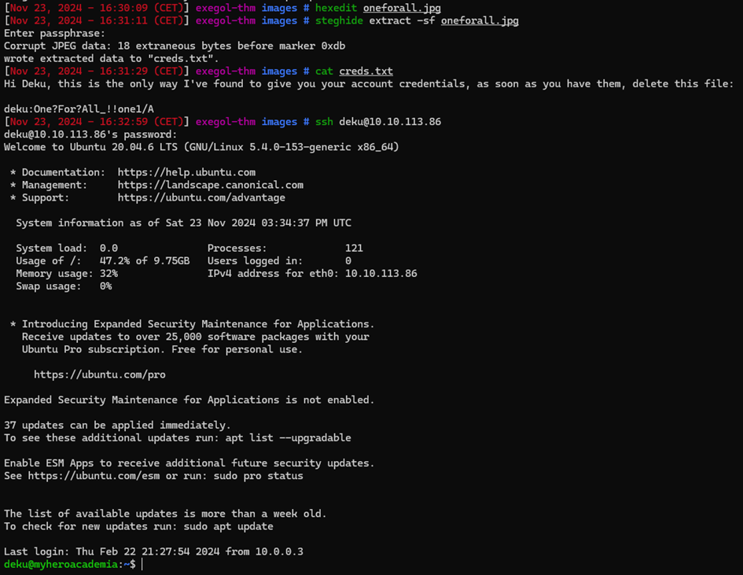
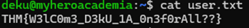

Pour l’escalation de privilège j’ai effectué la commande `sudo -l` pour voir où l’utilisateur deku a droits root.
Je tombe sur `/opt/NewComponent/feedback.sh`
feedback.sh exécutable en sudo qui demande un feedback en bloquant certains caractères et redirige vers `/var/log/feedback.txt` fichier avec des droits root.
J’ai donc ajouter la commande `deku    ALL=NOPASSWD:ALL >> /etc/sudoers` pour placer l’utilisateur deku dans le fichier sudoers et effectuer toutes les commandes en root sans mot de passe.

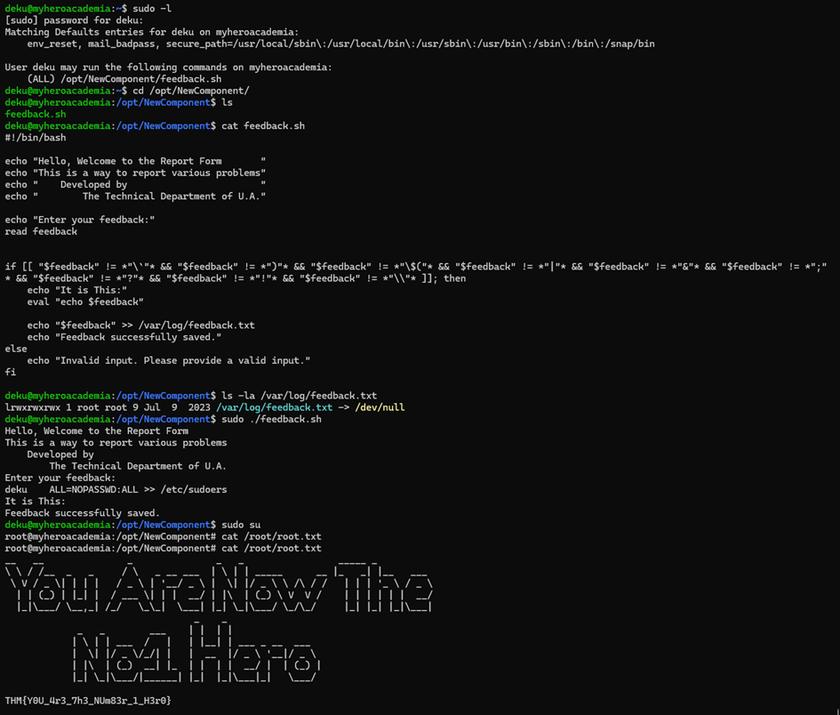
