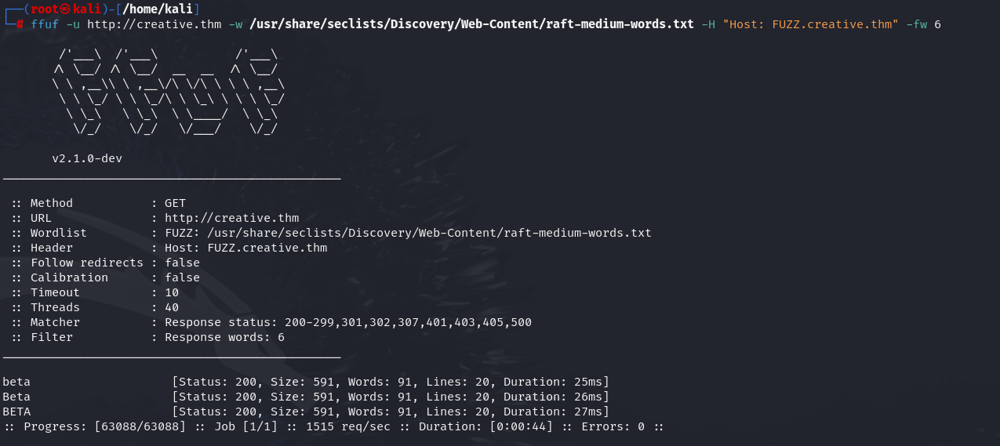
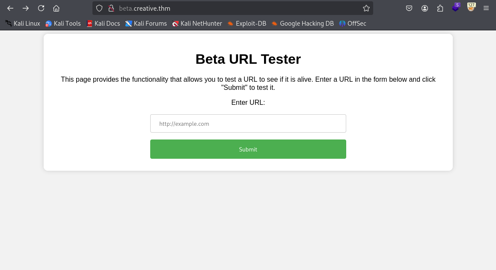

## Creative :

TryHackMe Easy

Énoncé :

> Exploitez une application Web vulnérable et certaines erreurs de configuration pour obtenir des privilèges root.

J'ai commencer par un scan nmap avec la commande suivant `nmap -sV -sC 10.10.97.21` ou j'ai trouver le port 80 et 22 d'ouvert.

Je me suis rendu dans mon navigateur pour voir le site web mais impossible. J'ai donc ajouter l'ip de la machine dans mon fichier `/etc/hosts` en indiquant : 10.10.97.21 creative.thm
Une fois sur le site creative.thm j'ai tenter de l'injection de code HTML et XSS mais sans succes.

Je suis passer a la phase d'enumeration avec gobuster sur avec plusieurs wordlists mais aucun resultat mise a part un dossier "assets". J'ai donc poursuivi en utilisant ffuf avec la commande : `ffuf -u http://creative.thm -w /usr/share/seclists/Discovery/Web-Content/raft-medium-words.txt -H "Host: FUZZ.creative.thm" -fw 6`

J'ai immediatement ajouter "beta.creative.thm" dans mon fichier `/etc/hosts`et j'ai pu acceder a cette page.

J'ai tenter de rentrer l'adresse 127.0.0.1:80 ce qui ma renvoyer le resultat suivant

J'ai egalement tenter sur le port 443

Apres ca, j'ai lister tous les ports avec Intruder de Burpsuite

Apres avoir trouver un resultat sur le port 1337, j'ai tenter d'acceder au repertoir /home ou j'ai pu trouver un utilisateur.

J'ai tenter une connexion ssh grace a l'id_rsa

Pour extraire l'empreinte du mot de passe j'ai utiliser la commande `ssh2john id_rsa > hash.txt` puis `john --wordlist=/usr/share/wordlists/rockyou.txt hash.txt` afin du brute forcce le hash du mot de passe

Le premier flag user

J'ai pu trouver un mot de passe dans le fichier `.bash_history

Pour l'escalation de privilege je me suis servi de cette source : https://www.hackingarticles.in/linux-privilege-escalation-using-ld_preload/

