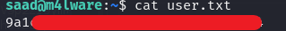

# Creative

**TryHackMe Easy**

## Énoncé

> Exploitez une application Web vulnérable et certaines erreurs de configuration pour obtenir des privilèges root.

---

## Étape 1 : Scan Nmap

J'ai commencé par un scan Nmap avec la commande suivante :  
`nmap -sV -sC 10.10.97.21`, où j'ai trouvé les ports 80 et 22 ouverts.

Je me suis rendu sur mon navigateur pour examiner le site web, mais c'était impossible d'y accéder. J'ai donc ajouté l'IP de la machine dans mon fichier `/etc/hosts` en indiquant :  
`10.10.97.21 creative.thm`.

Une fois sur le site `creative.thm`, j'ai tenté une injection de code HTML et XSS, mais sans succès.

Je suis passé à la phase d'énumération avec Gobuster en utilisant plusieurs wordlists, mais aucun résultat à part un dossier nommé "assets".  
J'ai donc poursuivi en utilisant **ffuf** avec la commande :  
`ffuf -u http://creative.thm -w /usr/share/seclists/Discovery/Web-Content/raft-medium-words.txt -H "Host: FUZZ.creative.thm" -fw 6`

J'ai immédiatement ajouté `beta.creative.thm` dans mon fichier `/etc/hosts`, et j'ai pu accéder à cette page.

J'ai tenté d'entrer l'adresse `127.0.0.1:80`, ce qui m'a renvoyé le résultat suivant :

J'ai également essayé sur le port 443 :

Après cela, j'ai listé tous les ports avec Intruder de BurpSuite :

Après avoir trouvé un résultat sur le port **1337**, j'ai tenté d'accéder au répertoire `/home`, où j'ai pu identifier un utilisateur.

J'ai tenté une connexion SSH grâce au fichier `id_rsa` :

Pour extraire l'empreinte du mot de passe, j'ai utilisé la commande :  
`ssh2john id_rsa > hash.txt`, puis  
`john --wordlist=/usr/share/wordlists/rockyou.txt hash.txt`  
afin de brute-forcer le hash du mot de passe.

J'ai récupéré le premier flag utilisateur :

J'ai trouvé un mot de passe dans le fichier `.bash_history`.

Pour l'escalade de privilèges, je me suis servi de cette source :  
[Linux Privilege Escalation using LD_PRELOAD](https://www.hackingarticles.in/linux-privilege-escalation-using-ld_preload/)

