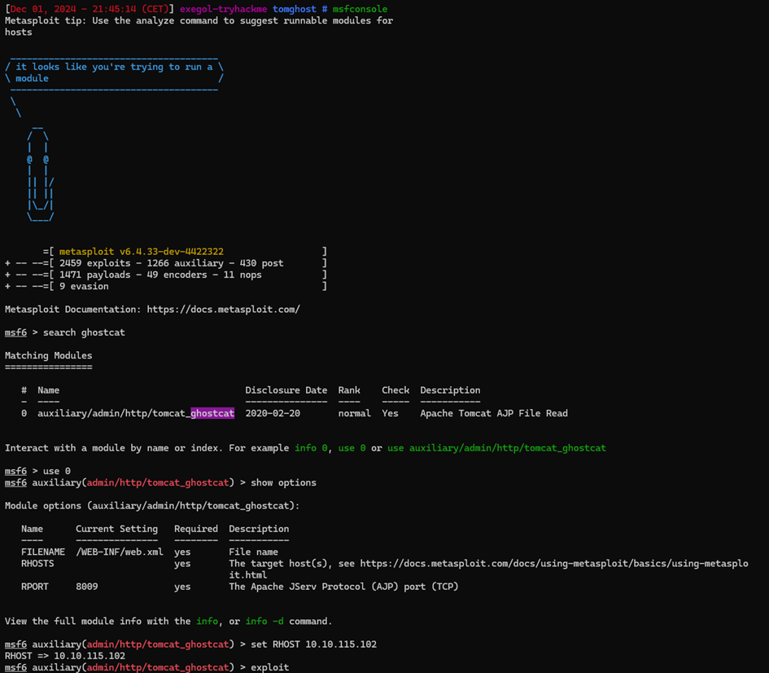

## tomghost :

TryHackMe Easy

Enoncer :
>Identifiez les vulnérabilités récentes pour tenter d’exploiter le système ou de lire des fichiers auxquels vous ne devriez pas avoir accès.

J'ai commencer l'énumération de ports avec nmap : `nmap -sV -sC 10.10.115.102`

J’ai commencé l’énumération du site web en attendant de rechercher un exploit
`gobuster dir -u http://10.10.115.102:8080 -w /opt/seclists/Discovery/Web-Content/common.txt`

J’ai pu trouver une CVE et l'exploiter, ce qui m'a permis de trouver un username et un password pour me connecter en ssh et récupérer le premier user flag

J’ai ouvert un serveur web afin de récupérer et cracker le fichier `tryhackme.asc`

J’ai donc utilisé la commande `gpg2john tryhackme.asc > hash`et récupérer le mot de passe pour ouvrir le fichier `credential.pgp`

Après avoir récupérer le mot de passe de l’utilisateur merlin je me suis connecter en ssh et essayer une élévation de privilèges

J’ai pu trouver sur gtfobins les commandes pour élever mes privilèges
` TF=$(mktemp -u)
sudo zip $TF /etc/hosts -T -TT 'sh #'
sudo rm $TF`

